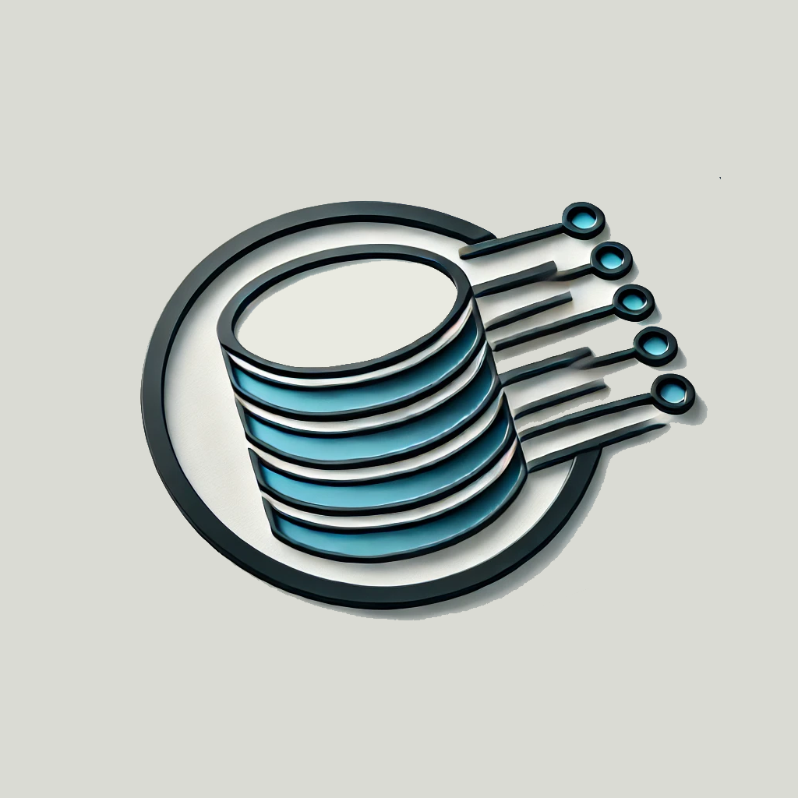

# Godex

Godex provides a simple utility for creating and storing reusable queries

<div align="center">
    
</div>

### Example 

##### Creating a Codex
```go
q := Codex{
    Table: "posts",
    DefaultQueries: DefaultQueries{
        SelectById: "SELECT * FROM posts WHERE id = :id",
        SelectOne:  "SELECT * FROM posts WHERE id = :id and post_title = :post_title",
        Select:     "SELECT * FROM posts WHERE created_at > '2020-05-10 12:23:43'",
        Insert:     "INSERT INTO posts(post_id) VALUES (:post_id)",
        Update:     "UPDATE posts SET is_active=:is_active WHERE id=:id",
        Delete:     "DELETE FROM posts WHERE id=:id",
        SoftDelete: "UPDATE posts SET deleted_at=CURRENT_TIMESTAMP() WHERE id=:id",
    },
    Queries: map[string]string{
        "SelectUsersByFirstName": "SELECT * FROM users WHERE first_name = :first_name",
    },
}
```

##### Default Queries

```go
res, err := q.SelectOne(CxArgs{"id": 154, "post_title": "Hello World"})
if err != nil {
	panic(err)
}
fmt.Println(res.postId)
```

##### Custom Queries

```go
_, err := q.RawQuery(q.Queries["SelectUsersByFirstName"], CxArgs{"first_name": "John"})
if err != nil {
    return
}
```


### Roadmap

1. Integrate Migrations into Godex (a feature which exists within Sphire's Codex utility)
2. Unit tests
3. Github Actions
